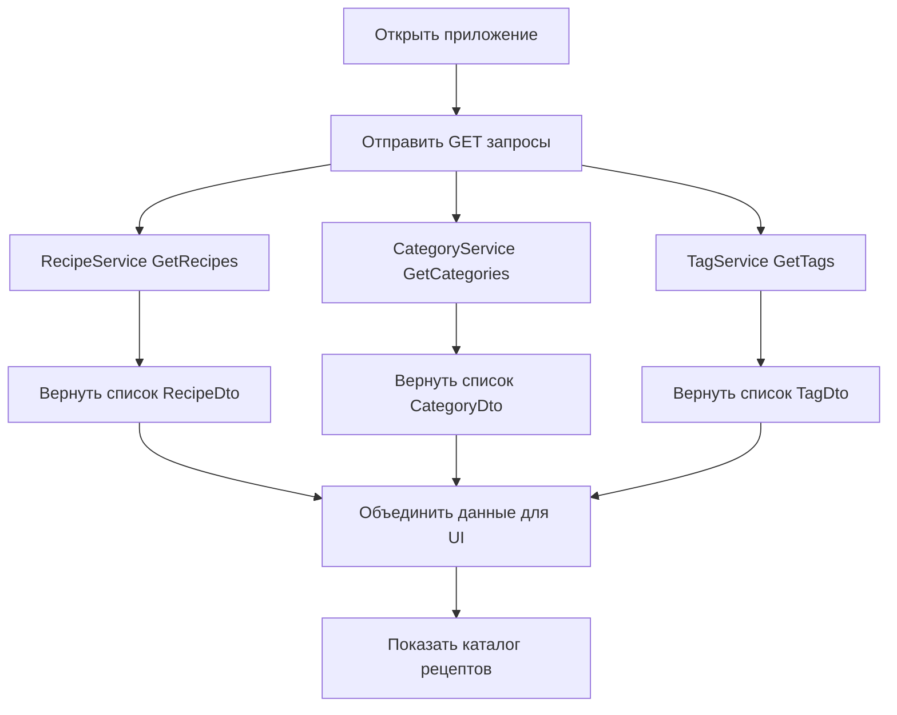
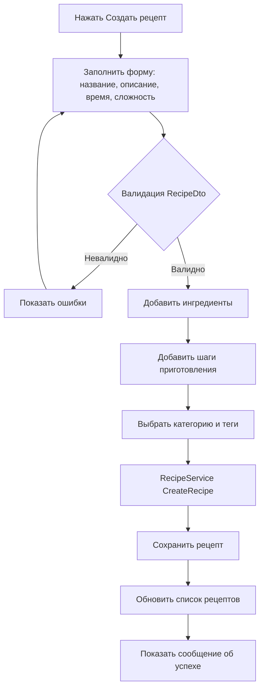
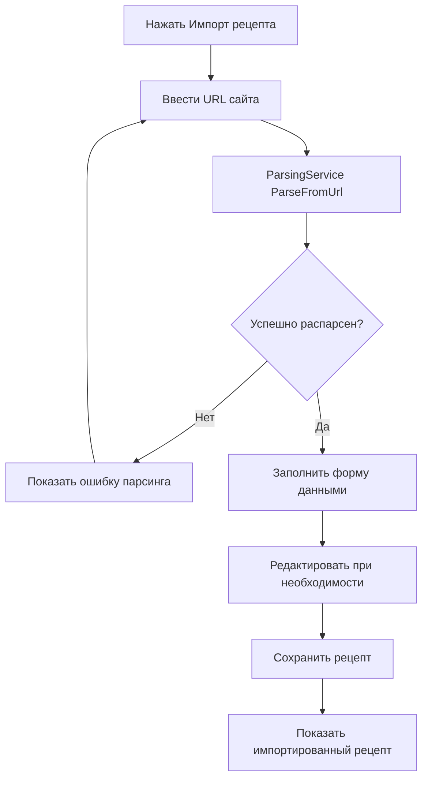

## 📊 Диаграммы активностей Cookbook

### 1. Загрузка рецептов


### 2. Создание рецепта


### 3.Импорт рецепта с сайта


### 3.Режим приготовления
```mermaid
flowchart TD
    A[Выбрать рецепт]
    A --> B[Нажать Режим приготовления]
    B --> C[Показать первый шаг]
    C --> D{Шаг с таймером?}
    D -->|Да| E[Запустить таймер]
    D -->|Нет| F[Ждать действия пользователя]
    E --> F
    F --> G[Нажать Далее]
    G --> H{Последний шаг?}
    H -->|Нет| I[Показать следующий шаг]
    I --> D
    H -->|Да| J[Показать завершение]
