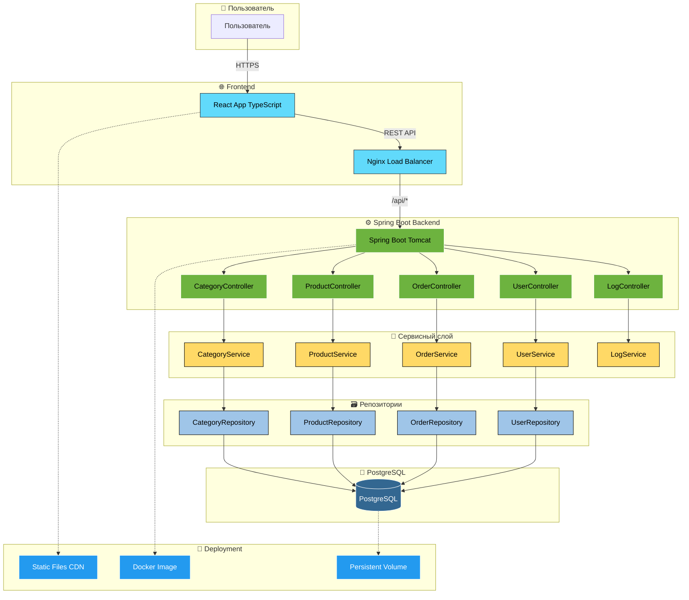

```mermaid
graph TB
    %% ---------- Пользователь ----------
    subgraph "👤 Пользователь"
        U[Пользователь]
    end

    %% ---------- Frontend ----------
    subgraph "🌐 Frontend"
        U --> |HTTPS| RA[React App TypeScript]
        RA --> |REST API| GLB
    end

    %% ---------- Gateway / LB ----------
    GLB[Nginx Load Balancer]

    %% ---------- Backend ----------
    subgraph "⚙️ Spring Boot Backend"
        GLB --> |/api/*| SB[Spring Boot Tomcat]
        SB --> CC[CategoryController]
        SB --> PC[ProductController]
        SB --> OC[OrderController]
        SB --> UC[UserController]
        SB --> LC[LogController]
    end

    %% ---------- Services ----------
    subgraph "🔧 Сервисный слой"
        CC --> CS[CategoryService]
        PC --> PS[ProductService]
        OC --> OS[OrderService]
        UC --> US[UserService]
        LC --> LS[LogService]
    end

    %% ---------- Repositories ----------
    subgraph "🗃️ Репозитории"
        CS --> CR[CategoryRepository]
        PS --> PR[ProductRepository]
        OS --> OR[OrderRepository]
        US --> UR[UserRepository]
    end

    %% ---------- База данных ----------
    subgraph "🐘 PostgreSQL"
        CR --> DB[(PostgreSQL)]
        PR --> DB
        OR --> DB
        UR --> DB
    end

    %% ---------- Deployment ----------
    subgraph "🐳 Deployment"
        RA -.-> STATIC[Static Files CDN]
        SB -.-> DOCK[Docker Image]
        DB -.-> VOL[Persistent Volume]
    end

    %% ---------- Цветовые классы ----------
    classDef frontend fill:#61dafb,stroke:#282c34,color:#000
    classDef backend fill:#6db33f,stroke:#fff,color:#000
    classDef service fill:#ffd966,stroke:#000,color:#000
    classDef repo fill:#9fc5e8,stroke:#000,color:#000
    classDef db fill:#336791,stroke:#fff,color:#fff
    classDef deployment fill:#239aef,stroke:#fff,color:#fff

    class RA,GLB frontend
    class SB,CC,PC,OC,UC,LC backend
    class CS,PS,OS,US,LS service
    class CR,PR,OR,UR repo
    class DB db
    class STATIC,DOCK,VOL deployment
```
