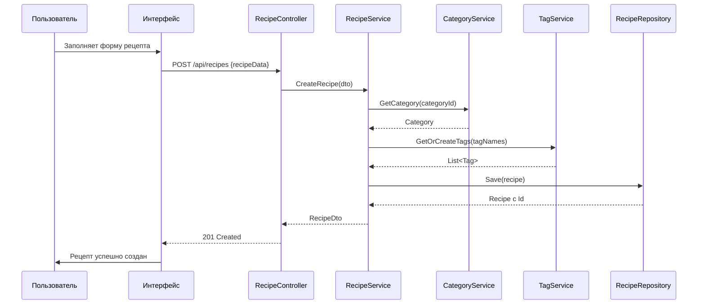
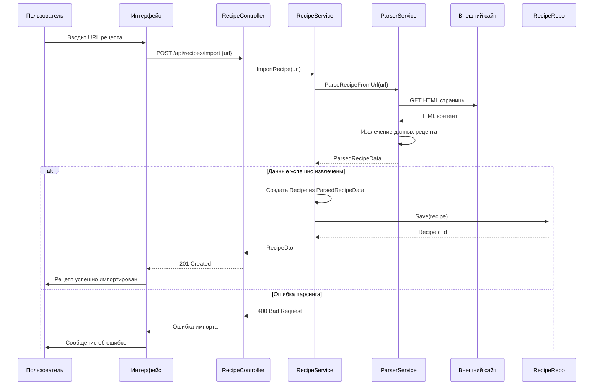
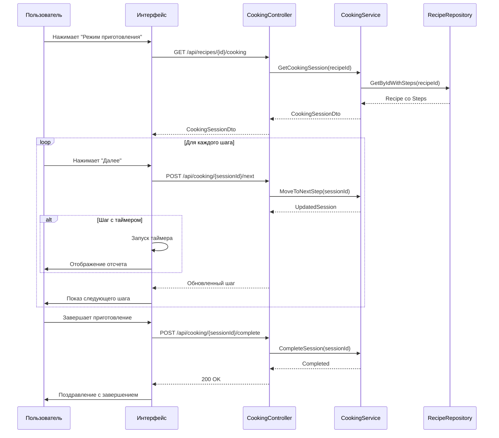

# 📊 Диаграммы последовательностей Cookbook

### 1. Создание рецепта

```mermaid
sequenceDiagram
    participant User as Пользователь
    participant Frontend as Интерфейс
    participant RecipeController as RecipeController
    participant RecipeService as RecipeService
    participant CategoryService as CategoryService
    participant TagService as TagService
    participant RecipeRepo as RecipeRepository

    User->>Frontend: Заполняет форму рецепта
    Frontend->>RecipeController: POST /api/recipes {recipeData}
    RecipeController->>RecipeService: CreateRecipe(dto)
    
    RecipeService->>CategoryService: GetCategory(categoryId)
    CategoryService-->>RecipeService: Category
    
    RecipeService->>TagService: GetOrCreateTags(tagNames)
    TagService-->>RecipeService: List<Tag>
    
    RecipeService->>RecipeRepo: Save(recipe)
    RecipeRepo-->>RecipeService: Recipe с Id
    
    RecipeService-->>RecipeController: RecipeDto
    RecipeController-->>Frontend: 201 Created
    Frontend->>User: Рецепт успешно создан
```

### 2. Импорт рецепта с сайта

```mermaid
sequenceDiagram
    participant User as Пользователь
    participant Frontend as Интерфейс
    participant RecipeController as RecipeController
    participant RecipeService as RecipeService
    participant ParserService as ParserService
    participant ExternalSite as Внешний сайт

    User->>Frontend: Вводит URL рецепта
    Frontend->>RecipeController: POST /api/recipes/import {url}
    RecipeController->>RecipeService: ImportRecipe(url)
    RecipeService->>ParserService: ParseRecipeFromUrl(url)
    ParserService->>ExternalSite: GET HTML страницы
    ExternalSite-->>ParserService: HTML контент
    ParserService->>ParserService: Извлечение данных рецепта
    ParserService-->>RecipeService: ParsedRecipeData
    
    alt Данные успешно извлечены
        RecipeService->>RecipeService: Создать Recipe из ParsedRecipeData
        RecipeService->>RecipeRepo: Save(recipe)
        RecipeRepo-->>RecipeService: Recipe с Id
        RecipeService-->>RecipeController: RecipeDto
        RecipeController-->>Frontend: 201 Created
        Frontend->>User: Рецепт успешно импортирован
    else Ошибка парсинга
        RecipeService-->>RecipeController: 400 Bad Request
        RecipeController-->>Frontend: Ошибка импорта
        Frontend->>User: Сообщение об ошибке
    end
```

###3. Режим приготовления

```mermaid
sequenceDiagram
    participant User as Пользователь
    participant Frontend as Интерфейс
    participant CookingController as CookingController
    participant CookingService as CookingService
    participant RecipeRepo as RecipeRepository

    User->>Frontend: Нажимает "Режим приготовления"
    Frontend->>CookingController: GET /api/recipes/{id}/cooking
    CookingController->>CookingService: GetCookingSession(recipeId)
    CookingService->>RecipeRepo: GetByIdWithSteps(recipeId)
    RecipeRepo-->>CookingService: Recipe со Steps
    CookingService-->>CookingController: CookingSessionDto
    CookingController-->>Frontend: CookingSessionDto
    
    loop Для каждого шага
        User->>Frontend: Нажимает "Далее"
        Frontend->>CookingController: POST /api/cooking/{sessionId}/next
        CookingController->>CookingService: MoveToNextStep(sessionId)
        CookingService-->>CookingController: UpdatedSession
        
        alt Шаг с таймером
            Frontend->>Frontend: Запуск таймера
            Frontend->>User: Отображение отсчета
        end
        
        CookingController-->>Frontend: Обновленный шаг
        Frontend->>User: Показ следующего шага
    end
    
    User->>Frontend: Завершает приготовление
    Frontend->>CookingController: POST /api/cooking/{sessionId}/complete
    CookingController->>CookingService: CompleteSession(sessionId)
    CookingService-->>CookingController: Completed
    CookingController-->>Frontend: 200 OK
    Frontend->>User: Поздравление с завершением
```
