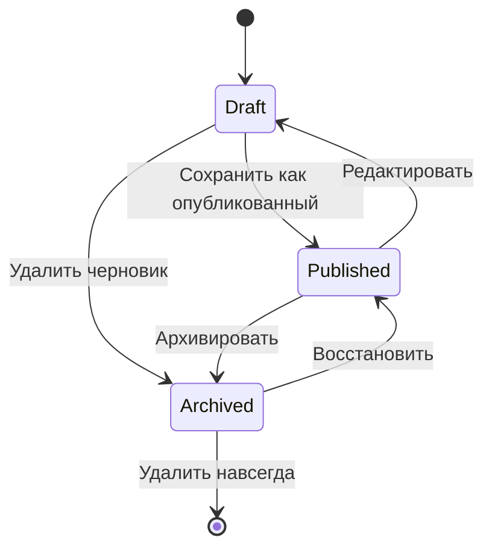
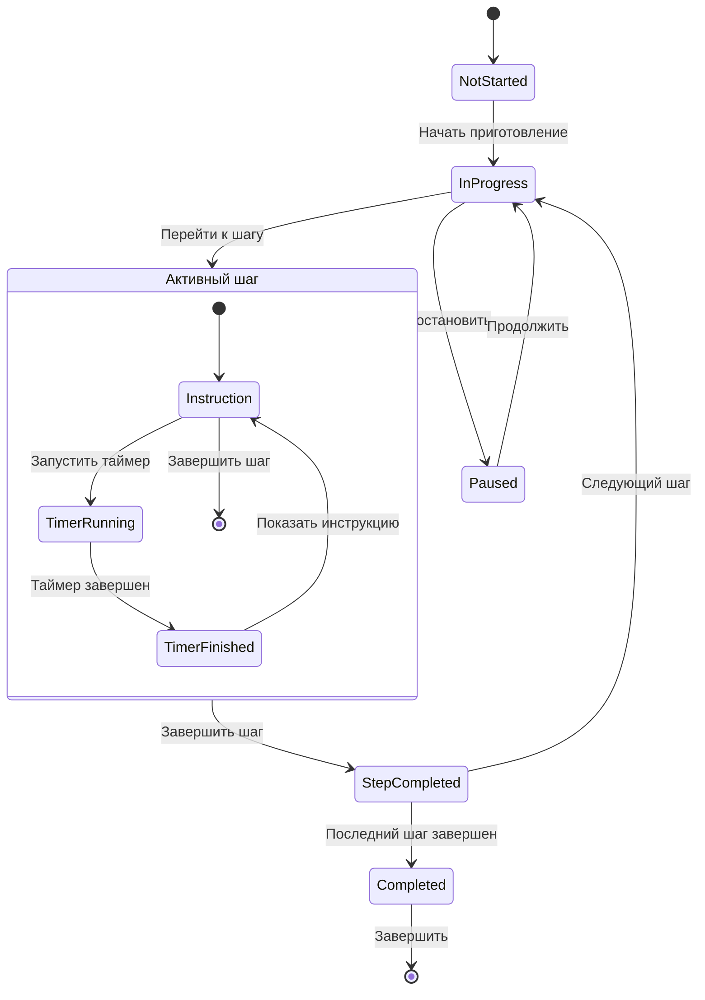

# 📊 Диаграммы состояний Cookbook

### 1. Состояние рецепта


### 2.Процесс приготовления


### 3.Состояние пользовательской сессии
```mermaid
stateDiagram-v2
    [*] --> Anonymous
    Anonymous --> Authenticating : Вход в систему
    Authenticating --> Authenticated : Успешная аутентификация
    Authenticating --> Anonymous : Ошибка аутентификации
    Authenticated --> Cooking : Запуск режима приготовления
    Authenticated --> Editing : Редактирование рецепта
    Authenticated --> Browsing : Просмотр рецептов
    Cooking --> Authenticated : Завершение приготовления
    Editing --> Authenticated : Сохранение рецепта
    Browsing --> Authenticated : Возврат в меню
    Authenticated --> Anonymous : Выход из системы
