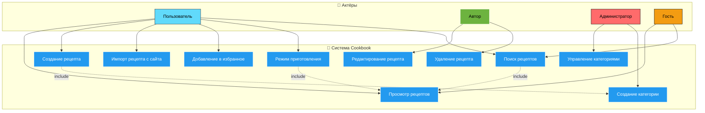

# 📊 Диаграмма вариантов использования Cookbook

# Глоссарий

| Термин | Определение |
|:--|:--|
| Пользователь | Зарегистрированный пользователь, который может создавать и просматривать рецепты |
| Автор | Пользователь, создавший рецепт |
| Рецепт | Основная сущность системы: содержит название, описание, ингредиенты и шаги приготовления |
| Ингредиент | Компонент рецепта с названием, количеством и единицей измерения |
| Шаг приготовления | Элемент рецепта с инструкцией и опциональным таймером |
| Категория | Группа рецептов (например, десерты, основные блюда, завтраки) |
| Тег | Метка для организации и поиска рецептов |
| Избранное | Коллекция рецептов, добавленных пользователем для быстрого доступа |

---

# Содержание
1 [Актёры](#actors)  
2 [Варианты использования](#use_cases)  
2.1 [Просмотр рецептов](#view_recipes)  
2.2 [Создание рецепта](#create_recipe)  
2.3 [Редактирование рецепта](#edit_recipe)  
2.4 [Импорт рецепта](#import_recipe)  
2.5 [Добавление в избранное](#add_favorite)  
2.6 [Режим приготовления](#cooking_mode)  
2.7 [Поиск рецептов](#search_recipes)  
2.8 [Управление категориями](#manage_categories)  

---

# 1 Актёры

| Актёр | Описание |
|:--|:--|
| Пользователь | Зарегистрированный пользователь, который может создавать, редактировать и просматривать рецепты |
| Автор | Пользователь, создавший конкретный рецепт |
| Гость | Неавторизованный посетитель, который может только просматривать публичные рецепты |

---

# 2 Варианты использования

---

## 2.1 Просмотр рецептов

**Описание.** Позволяет пользователю просматривать список доступных рецептов.  
**Предусловия.** Система загружена и доступна.  
**Основной поток.**
1. Пользователь открывает главную страницу приложения;  
2. Система отправляет запросы на `/api/recipes`;  
3. Сервер возвращает список рецептов;  
4. Система отображает их в виде карточек;  
5. Пользователь может фильтровать по категории, тегам или сложности;  
6. Вариант использования завершается.  

---

## 2.2 Создание рецепта

**Описание.** Позволяет пользователю создать новый рецепт.  
**Предусловия.** Пользователь авторизован.  
**Основной поток.**
1. Пользователь нажимает «Создать рецепт»;  
2. Система открывает форму создания рецепта;  
3. Пользователь вводит основные данные (название, описание, время приготовления);  
4. Пользователь добавляет ингредиенты;  
5. Пользователь добавляет шаги приготовления;  
6. Пользователь выбирает категорию и теги;  
7. Система проверяет корректность данных;  
8. Рецепт сохраняется в базе данных;  
9. Система уведомляет об успешном создании.  

**Альтернативный поток А1.**  
1. Введены невалидные данные;  
2. Система отображает сообщение об ошибке;  
3. Пользователь исправляет данные и повторяет попытку.  

---

## 2.3 Редактирование рецепта

**Описание.** Позволяет автору редактировать существующий рецепт.  
**Предусловия.** Пользователь авторизован и является автором рецепта.  
**Основной поток.**
1. Пользователь открывает карточку своего рецепта;  
2. Нажимает «Редактировать»;  
3. Вносит изменения в поля;  
4. Система проверяет валидность данных;  
5. Обновляет запись на сервере;  
6. Отображает уведомление об успешном обновлении.  

---

## 2.4 Импорт рецепта

**Описание.** Позволяет пользователю импортировать рецепт с внешнего сайта.  
**Предусловия.** Пользователь авторизован.  
**Основной поток.**
1. Пользователь нажимает «Импорт рецепта»;  
2. Вводит URL сайта с рецептом;  
3. Система парсит данные с сайта;  
4. Заполняет форму данными рецепта;  
5. Пользователь проверяет и корректирует данные;  
6. Рецепт сохраняется в системе.  

**Альтернативный поток А1.**  
1. Не удалось распарсить сайт;  
2. Система сообщает об ошибке;  
3. Пользователь вводит другой URL или создает рецепт вручную.  

---

## 2.5 Добавление в избранное

**Описание.** Позволяет пользователю сохранить рецепт в избранное.  
**Предусловия.** Пользователь авторизован.  
**Основной поток.**
1. Пользователь нажимает на иконку «Избранное» на карточке рецепта;  
2. Система отправляет запрос `/api/favorites`;  
3. Сервер сохраняет связь между пользователем и рецептом;  
4. Иконка меняет состояние на активное.  

**Альтернативный поток А1.**  
1. Рецепт уже был добавлен;  
2. Система удаляет рецепт из избранного.  

---

## 2.6 Режим приготовления

**Описание.** Позволяет пользователю готовить по рецепту с пошаговым руководством.  
**Предусловия.** Пользователь открыл карточку рецепта.  
**Основной поток.**
1. Пользователь нажимает «Режим приготовления»;  
2. Система показывает первый шаг с инструкцией;  
3. Если шаг содержит таймер, система запускает отсчет;  
4. Пользователь нажимает «Далее» для перехода к следующему шагу;  
5. После последнего шага система показывает сообщение о завершении.  

---

## 2.7 Поиск рецептов

**Описание.** Позволяет пользователю находить рецепты по различным критериям.  
**Предусловия.** Система загружена.  
**Основной поток.**
1. Пользователь вводит поисковый запрос в поле поиска;  
2. Система отправляет запрос `/api/recipes/search`;  
3. Сервер возвращает подходящие рецепты;  
4. Система отображает результаты поиска;  
5. Пользователь может применять дополнительные фильтры.  

---

## 2.8 Управление категориями

**Описание.** Позволяет администратору управлять категориями рецептов.  
**Предусловия.** Пользователь имеет права администратора.  
**Основной поток.**
1. Администратор переходит в раздел управления категориями;  
2. Создает, редактирует или удаляет категории;  
3. Система сохраняет изменения;  
4. Обновляет список категорий во всех рецептах.  
